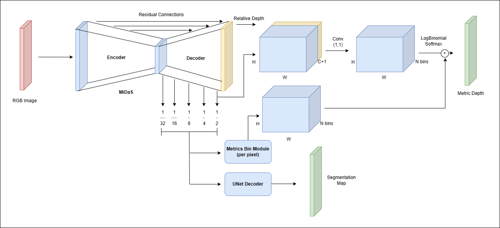
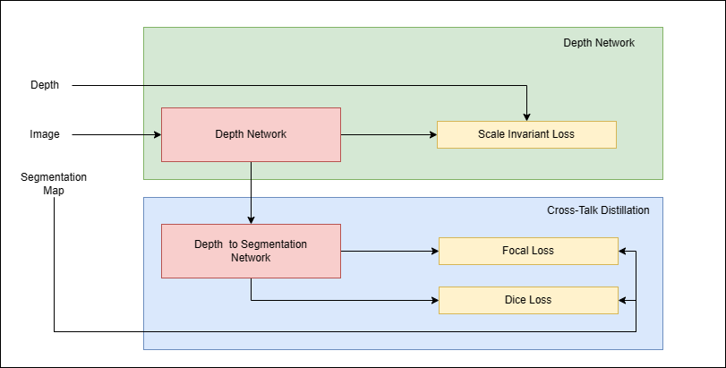

# Zoe-Distill

## About model:

The model architecture integrates ZoeDepth’s[1] cutting-edge design with an augmented depth-to-segmentation network,
facilitating the transformation of predicted relative depth into segmentation. This innovation fosters a symbiotic relationship
between the segmentation ground truth maps and the depth network during training, enabling seamless knowledge transfer across
tasks.

Moreover, our approach involves a consolidation of semantic classes within the NYU V2[3] dataset, condensing them into
a concise group of 14 classes (using the mapping from [7] for model training. Leveraging the feature maps derived from the
MiDaS[5] core’s decoder, both the segmentation head (U-Net)[6] and the ZoeDepth’s bin module for metric depth are employed.
This strategic fusion introduces additional semantic context from the input image to the MiDaS[5] core, thereby enhancing the
efficacy of the training process.

Notably, this augmentation doesn’t impact inference time as the segmentation component remains inactive during inference.
The visualisation of overall model architecture is shown in Fig 1. The total number of parameters of the model is 105.3M.
Subsequent sections will delve into an in-depth exploration of each core component, elucidating their roles and functionalities
within the model framework.

## About ZoeDepth:
ZoeDepth[1], a state-of-the-art (SOTA) model, comprises essential components: the MiDaS[5] Core, responsible for extracting
feature maps and predicting relative depth maps; a metric bins module, predicting bin centers corresponding to each pixel in the
depth map; and a metric depth head module, utilizing log softmax probabilities from the bin centers to derive the final metric
depth values for individual pixels. These pixel-wise probabilities serve as weightings for the predicted bin centers, contributing
to the model’s depth estimation process.

##  Segmentation Cross-Talk Distillation:

The feature outputs from the encoder-decoder network, scaled at different levels (1/32, 1/16, 1/8, 1/4, 1/2), serve as input
features for the UNet[6] Decoder. The decoder network (expansive path) takes the feature map from the lower layer, up-converts
it, crops and concatenates it with the encoder data of the same level, and then performs two 3×3 convolution layers followed by
ReLU activation 1. We use UNet[6] encoder with 5 decoder layers. This decoder, encompassing approximately 3M parameters,
generates the final logits for segmentation output. Upon computing the loss, Softmax is applied to derive class probabilities. The
training involves feeding the decoder with inputs associated with 14 distinct classes. The following diagram as shown in Fig 2
illustrates the distillation task while training.

## Parameters Comparison:
The following Table shows the parameters comparison of our model with other SOTA models.

| Model               | Encoder       | #Parameters |
|---------------------|---------------|-------------|
| Adabins[11]         | EfficientNet-B5 | 78M         |
| NeWCRFs[12]         | Swin-L          | 270M        |
| ZoeD-M12-N (S2-B)[1]| Swin2-B         | 102M        |
| ZoeD-M12-N (B-L)[1] | Beit-L          | 345M        |
| Our model           | Swin2-B         | 105M        |

## Dataset:
The datasets used in the experiments and the details are as lised in the Table.

| Dataset           | Domain  | Type  | Seen in Training? | Train Samples | Eval Samples | Eval Depth (m)     |
|-------------------|---------|-------|-------------------|---------------|--------------|--------------------|
|                   |         |       |                   |               |              | Min  | Max          |
| NYU V2[3]         | Indoor  | Real  | Yes               | 1158          | 291          | 1e-3 | 10           |
| iBims-1[4]        | Indoor  | Real  | Yes               | -             | 100          | 1e-3 | 10           |

## Evaluation Metrics:
### NYU-V2 Dataset-
| Model                 | δ1 ↑   | δ2 ↑   | δ3 ↑   | REL ↓  | RMSE ↓ | log10 ↓ |
|-----------------------|--------|--------|--------|--------|--------|---------|
| Adabins[11]           | 0.903  | 0.984  | 0.997  | 0.103  | 0.364  | 0.044   |
| NeWCRFs[12]           | 0.922  | 0.992  | 0.998  | 0.095  | 0.334  | 0.041   |
| ZoeDepth (S2-B)[1]    | 0.927  | 0.992  | 0.999  | 0.090  | 0.313  | 0.038   |
| ZoeDepth (B-L)[1]     | 0.955  | 0.995  | 0.999  | 0.075  | 0.270  | 0.032   |
| Our model             | 0.980  | 0.998  | 0.999  | 0.048  | 0.2    | 0.021   |

### iBims-1 Dataset:
| Model                 | δ1 ↑   | δ2 ↑   | δ3 ↑   | REL ↓  | RMSE ↓ | log10 ↓ |
|-----------------------|--------|--------|--------|--------|--------|---------|
| Adabins[11]           | 0.555  | 0.873  | 0.960  | 0.212  | 0.901  | 0.107   |
| NeWCRFs[12]           | 0.548  | 0.884  | 0.979  | 0.206  | 0.861  | 0.102   |
| ZoeDepth (B-L)[1]     | 0.658  | 0.947  | 0.985  | 0.169  | 0.711  | 0.083   |
| Our model             | 0.669  | 0.924  | 0.972  | 0.182  | 0.922  | 0.086   |

## Plots:
### NYU-V2-
![NYU-V2_Plots][nyu.png]

### iBims-1-
![iBims-1_Plots][ibims.png]

## References:
[1] S. F. Bhat, R. Birkl, D. Wofk, P. Wonka, and M. M{\"u}ller, *ZoeDepth: Zero-shot Transfer by Combining Relative and Metric Depth*, ArXiv preprint, [arXiv:2302.12288](https://arxiv.org/abs/2302.12288), 2023.

[2] H. Cai, J. Matai, S. Borse, Y. Zhang, A. Ansari, and F. Porikli, *X-Distill: Improving Self-Supervised Monocular Depth via Cross-Task Distillation*, ArXiv preprint, [arXiv:2110.12516](https://arxiv.org/abs/2110.12516), 2021.

[3] Nathan Silberman, Derek Hoiem, Pushmeet Kohli, and Rob Fergus, *Indoor Segmentation and Support Inference from RGBD Images*, *ECCV*, 2012.

[4] Tobias Koch, Lukas Liebel, Friedrich Fraundorfer, and Marco Korner, *Evaluation of CNN-based Single-Image Depth Estimation Methods*, In *Proceedings ECCV 2018 Workshops*, 2019.

[5] Rene Ranftl, Katrin Lasinger, David Hafner, Konrad Schindler, and Vladlen Koltun, *Towards Robust Monocular Depth Estimation: Mixing Datasets for Zero-shot Cross-dataset Transfer*, *IEEE Transactions on Pattern Analysis and Machine Intelligence (TPAMI)*, 2020.

[6] Olaf Ronneberger, Philipp Fischer, and Thomas Brox, *U-Net: Convolutional Networks for Biomedical Image Segmentation*, ArXiv preprint, [arXiv:1505.04597](https://arxiv.org/abs/1505.04597), 2015.

[7] Ankur Handa, *nyuv2-meta-data*, GitHub repository, [nyuv2-meta-data](https://github.com/ankurhanda/nyuv2-meta-data), 2017.

[8] Rene Ranftl, Alexey Bochkovskiy, and Vladlen Koltun, *Vision Transformers for Dense Prediction*, ArXiv preprint, [arXiv:2103.13413](https://arxiv.org/abs/2103.13413), 2021.

[9] Ze Liu, Han Hu, Yutong Lin, Zhuliang Yao, Zhenda Xie, Yixuan Wei, Jia Ning, Yue Cao, Zheng Zhang, Li Dong, Furu Wei, and Baining Guo, *Swin Transformer V2: Scaling Up Capacity and Resolution*, in *International Conference on Computer Vision and Pattern Recognition (CVPR)*, 2022.

[10] Hangbo Bao, Li Dong, and Furu Wei, *Beit: BERT pretraining of image transformers*, CoRR, [abs/2106.08254](https://arxiv.org/abs/2106.08254), 2021.

[11] Shariq Farooq Bhat, Ibraheem Alhashim, and Peter Wonka, *Adabins: Depth estimation using adaptive bins*, in *Proceedings of the IEEE/CVF Conference on Computer Vision and Pattern Recognition*, pages 4009--4018, 2021.

[12] Weihao Yuan, Xiaodong Gu, Zuozhuo Dai, Siyu Zhu, and Ping Tan, *New CRFs: Neural window fully-connected CRFs for monocular depth estimation*, arXiv preprint [arXiv:2203.01502](https://arxiv.org/abs/2203.01502), 2022.

